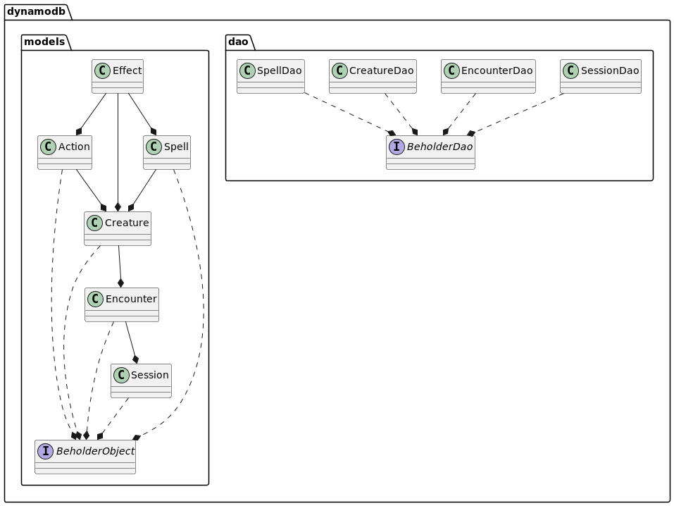
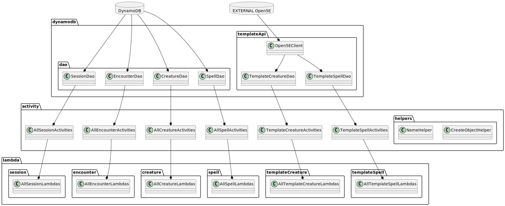

# Project Beholder Design Document

## **1. Problem Statement**

As a Dungeon Master (**DM**) for a 5th Edition Dungeons and Dragons (**D&D 5E**) game with a blend of local and remote players, I already use digital tools like the virtual tabletop [Roll20](https://roll20.net/welcome). Unfortunately, I find that combat encounters, which involve managing non-player-characters (**NPCs**), actions, status effects, and turn order, are still unwieldy because they involve managing many sources of information. I would like an application which allows me to build encounters while planning a session and then helps me manage them while actually running the game.

This design document will describe an application for building and managing D&D 5E encounters, with the following features:

* An NPC builder, which allows a user to create NPCs from templates
* An encounter builder, which allows a user to create encounters, populated with both player characters (**PCs**) and NPCs.
* An encounter manager, which a user can use while running a game (ideally on a tablet or other mobile device)
* Identity management (via Cognito) so that multiple users, even in the same gaming group, can design their own NPCs and encounters without ‘spying’ on each other

## **2. Use Cases**

1. As a DM, I want to log into the app and see only the materials/resources I have created
2. As a DM, I want to be able to create, edit, and delete NPCs
3. As a DM, I want the option to import an NPC template from an outside authority rather than having to build it from scratch
4. As a DM, I want the option to build an NPC from scratch
5. As a DM, I want to store a list of PCs in each encounter
6. As a DM, I want to create, edit, and delete encounters using pre-built NPCs and PCs
7. As a DM, I want to manage an encounter as I run a game

## **3. Project Scope**

**3.1. In Scope**

* App features described as ‘planned’

**1.2. Out of Scope**

* Most calculations around actions or spellcasting

## **4. Proposed Architecture Overview**

The back-end will consist of several tables stored in DynamoDB. Access to each will be managed by their own DAO, and each API endpoint call will be handled by its own activity.

The front-end will consist of several builder pages and an encounter management page - after logging into Cognito, the user should select either builder mode or encounter management mode. The pages will be built in HTML and backed by JavascriptThe front-end will communicate with the back-end via API endpoints. Templates can be generated using the [Open5e API](https://open5e.com/api-docs).

_^^Data objects and their relationships._

_^^High-level class diagram, not including POJOs, replies, requests, or converters. Plurals really represent a set of classes (e.g., multiple action activity classes), collapsed for simplicity._

## **5. API**

### 5.1. Public Models

<table>
  <tr>
   <td colspan="4" ><strong>Session POJO</strong>
   </td>
  </tr>
  <tr>
   <td><strong>Type</strong>
   </td>
   <td><strong>Name</strong>
   </td>
   <td><strong>Key</strong>
   </td>
   <td><strong>Expected Values</strong>
   </td>
  </tr>
  <tr>
   <td>String
   </td>
   <td>userEmail
   </td>
   <td>Hash
   </td>
   <td>Any
   </td>
  </tr>
  <tr>
   <td>String
   </td>
   <td>objectId
   </td>
   <td>Range
   </td>
   <td>Any (pregen)
   </td>
  </tr>
  <tr>
   <td>String
   </td>
   <td>objectName 
   </td>
   <td>
   </td>
   <td>Any
   </td>
  </tr>
  <tr>
   <td>ZonedDateTime
   </td>
   <td>createDateTime
   </td>
   <td>
   </td>
   <td>Any
   </td>
  </tr>
  <tr>
   <td>ZonedDateTime
   </td>
   <td>editDateTime
   </td>
   <td>
   </td>
   <td>Any
   </td>
  </tr>
</table>

<table>
  <tr>
   <td colspan="4" ><strong>Encounter POJO</strong>
   </td>
  </tr>
  <tr>
   <td><strong>Type</strong>
   </td>
   <td><strong>Name</strong>
   </td>
   <td><strong>Key</strong>
   </td>
   <td><strong>Expected Values</strong>
   </td>
  </tr>
  <tr>
   <td>String
   </td>
   <td>userEmail
   </td>
   <td>Hash
   </td>
   <td>Any
   </td>
  </tr>
  <tr>
   <td>String
   </td>
   <td>objectId
   </td>
   <td>Range
   </td>
   <td>Any (pregen)
   </td>
  </tr>
  <tr>
   <td>String
   </td>
   <td>objectName
   </td>
   <td>
   </td>
   <td>Any
   </td>
  </tr>
  <tr>
   <td>Map&lt;String, Creature>
   </td>
   <td>creatureMap
   </td>
   <td>
   </td>
   <td>Any
   </td>
  </tr>
  <tr>
   <td>Integer 
   </td>
   <td>encounterTurn
   </td>
   <td>
   </td>
   <td>>= 0
   </td>
  </tr>
  <tr>
   <td>PriorityQueue&lt;Creature>
   </td>
   <td>turnOrder
   </td>
   <td>
   </td>
   <td>Any
   </td>
  </tr>
  <tr>
   <td>String
   </td>
   <td>topOfOrder
   </td>
   <td>
   </td>
   <td>Any
   </td>
  </tr>
  <tr>
   <td>String
   </td>
   <td>sessionId
   </td>
   <td>
   </td>
   <td>Any
   </td>
  </tr>
  <tr>
   <td>ZonedDateTime
   </td>
   <td>createDateTime
   </td>
   <td>
   </td>
   <td>Any
   </td>
  </tr>
  <tr>
   <td>ZonedDateTime
   </td>
   <td>editDateTime
   </td>
   <td>
   </td>
   <td>Any
   </td>
  </tr>
</table>

<table>
  <tr>
   <td colspan="4" ><strong>Effect POJO</strong>
   </td>
  </tr>
  <tr>
   <td><strong>Type</strong>
   </td>
   <td><strong>Name</strong>
   </td>
   <td><strong>Key</strong>
   </td>
   <td><strong>Expected Values</strong>
   </td>
  </tr>
  <tr>
   <td>String
   </td>
   <td>objectId
   </td>
   <td>
   </td>
   <td>Any
   </td>
  </tr>
  <tr>
   <td>String
   </td>
   <td>effectName
   </td>
   <td>
   </td>
   <td>Any
   </td>
  </tr>
  <tr>
   <td>Integer
   </td>
   <td>turnDuration
   </td>
   <td>
   </td>
   <td>>= 1
   </td>
  </tr>
  <tr>
   <td>String
   </td>
   <td>blameSource
   </td>
   <td>
   </td>
   <td>Any
   </td>
  </tr>
  <tr>
   <td>String
   </td>
   <td>blameCreatureId
   </td>
   <td>
   </td>
   <td>Any
   </td>
  </tr>
  <tr>
   <td>Boolean
   </td>
   <td>blameConcentration
   </td>
   <td>
   </td>
   <td>TRUE/FALSE
   </td>
  </tr>
  <tr>
   <td>String
   </td>
   <td>saveType
   </td>
   <td>
   </td>
   <td>Any
   </td>
  </tr>
  <tr>
   <td>Integer
   </td>
   <td>saveDC
   </td>
   <td>
   </td>
   <td>>= 1
   </td>
  </tr>
  <tr>
   <td>Set&lt;String>
   </td>
   <td>saveOn
   </td>
   <td>
   </td>
   <td>start, end, damage
   </td>
  </tr>
  <tr>
   <td>Set&lt;String>
   </td>
   <td>endOn
   </td>
   <td>
   </td>
   <td>damage, save
   </td>
  </tr>
  <tr>
   <td>Integer
   </td>
   <td>damageAmount
   </td>
   <td>
   </td>
   <td>>= 0
   </td>
  </tr>
  <tr>
   <td>String
   </td>
   <td>damageType
   </td>
   <td>
   </td>
   <td>any
   </td>
  </tr>
  <tr>
   <td>Set&lt;String>
   </td>
   <td>endDamageOn
   </td>
   <td>
   </td>
   <td>start, end, damage
   </td>
  </tr>
</table>

<table>
  <tr>
   <td colspan="4" ><strong>Creature POJO</strong>
   </td>
  </tr>
  <tr>
   <td><strong>Type</strong>
   </td>
   <td><strong>Name</strong>
   </td>
   <td><strong>Key</strong>
   </td>
   <td><strong>Expected Values</strong>
   </td>
  </tr>
  <tr>
   <td>String
   </td>
   <td>userEmail
   </td>
   <td>Hash
   </td>
   <td>Any
   </td>
  </tr>
  <tr>
   <td>String
   </td>
   <td>objectId
   </td>
   <td>Range
   </td>
   <td>Any (pregen)
   </td>
  </tr>
  <tr>
   <td>Boolean
   </td>
   <td>draftStatus
   </td>
   <td>
   </td>
   <td>TRUE/FALSE
   </td>
  </tr>
  <tr>
   <td>String
   </td>
   <td>objectName
   </td>
   <td>
   </td>
   <td>Any
   </td>
  </tr>
  <tr>
   <td>String
   </td>
   <td>objectId
   </td>
   <td>
   </td>
   <td>Any
   </td>
  </tr>
  <tr>
   <td>String
   </td>
   <td>encounterCreatureId
   </td>
   <td>
   </td>
   <td>Any
   </td>
  </tr>
  <tr>
   <td>String
   </td>
   <td>encounterCreatureName
   </td>
   <td>
   </td>
   <td>Any
   </td>
  </tr>
  <tr>
   <td>Boolean
   </td>
   <td>isPC
   </td>
   <td>
   </td>
   <td>TRUE/FALSE
   </td>
  </tr>
  <tr>
   <td>Integer
   </td>
   <td>pcLevel
   </td>
   <td>
   </td>
   <td> 1  ≤ x ≥  20, or empty
   </td>
  </tr>
  <tr>
   <td>String
   </td>
   <td>sourceBook
   </td>
   <td>
   </td>
   <td>Any
   </td>
  </tr>
  <tr>
   <td>String
   </td>
   <td>creatureDescription
   </td>
   <td>
   </td>
   <td>Any
   </td>
  </tr>
  <tr>
   <td>String
   </td>
   <td>size
   </td>
   <td>
   </td>
   <td>Any
   </td>
  </tr>
  <tr>
   <td>String
   </td>
   <td>type
   </td>
   <td>
   </td>
   <td>Any
   </td>
  </tr>
  <tr>
   <td>String
   </td>
   <td>subtype
   </td>
   <td>
   </td>
   <td>Any
   </td>
  </tr>
  <tr>
   <td>String
   </td>
   <td>group
   </td>
   <td>
   </td>
   <td>Any
   </td>
  </tr>
  <tr>
   <td>String
   </td>
   <td>alignment
   </td>
   <td>
   </td>
   <td>Any
   </td>
  </tr>
  <tr>
   <td>Integer
   </td>
   <td>armorClass
   </td>
   <td>
   </td>
   <td>≥ 0
   </td>
  </tr>
  <tr>
   <td>String
   </td>
   <td>armorType
   </td>
   <td>
   </td>
   <td>Any
   </td>
  </tr>
  <tr>
   <td>Map&lt;String, Effect>
   </td>
   <td>activeEffects
   </td>
   <td>
   </td>
   <td>Map of Effect objects
   </td>
  </tr>
  <tr>
   <td>Boolean
   </td>
   <td>knockedOut
   </td>
   <td>
   </td>
   <td>TRUE/FALSE
   </td>
  </tr>
  <tr>
   <td>Boolean
   </td>
   <td>dead
   </td>
   <td>
   </td>
   <td>TRUE/FALSE
   </td>
  </tr>
  <tr>
   <td>Integer
   </td>
   <td>deathSaves
   </td>
   <td>
   </td>
   <td>≥ 0
   </td>
  </tr>
  <tr>
   <td>Integer
   </td>
   <td>hitPoints
   </td>
   <td>
   </td>
   <td>> 0
   </td>
  </tr>
  <tr>
   <td>Integer
   </td>
   <td>currentHitPoints
   </td>
   <td>
   </td>
   <td>≥ 0
   </td>
  </tr>
  <tr>
   <td>String
   </td>
   <td>hitDice
   </td>
   <td>
   </td>
   <td>Any
   </td>
  </tr>
  <tr>
   <td>Integer
   </td>
   <td>hitDiceMax
   </td>
   <td>
   </td>
   <td>> 0
   </td>
  </tr>
  <tr>
   <td>Integer
   </td>
   <td>currentHitDice
   </td>
   <td>
   </td>
   <td>≥ 0
   </td>
  </tr>
  <tr>
   <td>Map&lt;String, Integer>
   </td>
   <td>speedMap
   </td>
   <td>
   </td>
   <td>Map of String & Integer ≥ 0
   </td>
  </tr>
  <tr>
   <td>Map&lt;String, Integer>
   </td>
   <td>statMap
   </td>
   <td>
   </td>
   <td>Map of String & Integer ≥ 0
   </td>
  </tr>
  <tr>
   <td>Map&lt;String, Integer>
   </td>
   <td>saveMap
   </td>
   <td>
   </td>
   <td>Map of String & Integer -10  ≤ x ≤  10
   </td>
  </tr>
  <tr>
   <td>Integer
   </td>
   <td>passivePerception
   </td>
   <td>
   </td>
   <td>≥ 0
   </td>
  </tr>
  <tr>
   <td>Map&lt;String, Integer>
   </td>
   <td>skillsMap
   </td>
   <td>
   </td>
   <td>Map of String & Integer -10 ≤ x ≤  10
   </td>
  </tr>
  <tr>
   <td>String
   </td>
   <td>vulnerabilities
   </td>
   <td>
   </td>
   <td>Any
   </td>
  </tr>
  <tr>
   <td>String
   </td>
   <td>resistances
   </td>
   <td>
   </td>
   <td>Any
   </td>
  </tr>
  <tr>
   <td>String
   </td>
   <td>immunities
   </td>
   <td>
   </td>
   <td>Any
   </td>
  </tr>
  <tr>
   <td>String
   </td>
   <td>conditionImmunities
   </td>
   <td>
   </td>
   <td>Any
   </td>
  </tr>
  <tr>
   <td>&lt;String
   </td>
   <td>senses
   </td>
   <td>
   </td>
   <td>Any
   </td>
  </tr>
  <tr>
   <td>List&lt;String>
   </td>
   <td>languages
   </td>
   <td>
   </td>
   <td>Any
   </td>
  </tr>
  <tr>
   <td>Double
   </td>
   <td>challengeRating
   </td>
   <td>
   </td>
   <td>≥ 0
   </td>
  </tr>
  <tr>
   <td>Map&lt;String, List&lt;Action>
   </td>
   <td>actionMap
   </td>
   <td>
   </td>
   <td>Map of &lt;String actionType, List of Action objects>
   </td>
  </tr>
  <tr>
   <td>String
   </td>
   <td>legendaryDesc
   </td>
   <td>
   </td>
   <td>Any
   </td>
  </tr>
  <tr>
   <td>Map&lt;String, Spell>
   </td>
   <td>spellMap
   </td>
   <td>
   </td>
   <td>Map of &lt;String objectId, List of Map objects>
   </td>
  </tr>
  <tr>
   <td>Map&lt;Integer, Integer>
   </td>
   <td>spellSlots
   </td>
   <td>
   </td>
   <td>Map of Integer 1  ≤ x ≤  9 & Integer 0  ≤ x
   </td>
  </tr>
  <tr>
   <td>String
   </td>
   <td>spellcastingAbility
   </td>
   <td>
   </td>
   <td>Any
   </td>
  </tr>
  <tr>
   <td>Integer
   </td>
   <td>spellSaveDC
   </td>
   <td>
   </td>
   <td>≥ 0
   </td>
  </tr>
  <tr>
   <td>Integer
   </td>
   <td>spellAttackModifier
   </td>
   <td>
   </td>
   <td>≥ 0
   </td>
  </tr>
  <tr>
   <td>ZonedDateTime
   </td>
   <td>createDateTime
   </td>
   <td>
   </td>
   <td>Any
   </td>
  </tr>
  <tr>
   <td>ZonedDateTime
   </td>
   <td>editDateTime
   </td>
   <td>
   </td>
   <td>Any
   </td>
  </tr>
</table>

<table>
  <tr>
   <td colspan="4" ><strong>Action POJO</strong>
   </td>
  </tr>
  <tr>
   <td><strong>Type</strong>
   </td>
   <td><strong>Name</strong>
   </td>
   <td><strong>Key</strong>
   </td>
   <td><strong>Expected Values</strong>
   </td>
  </tr>
  <tr>
   <td>String
   </td>
   <td>userEmail
   </td>
   <td>Hash
   </td>
   <td>Any
   </td>
  </tr>
  <tr>
   <td>String
   </td>
   <td>objectId
   </td>
   <td>Range
   </td>
   <td>Any (pregen)
   </td>
  </tr>
  <tr>
   <td>String
   </td>
   <td>objectName
   </td>
   <td>
   </td>
   <td>Any
   </td>
  </tr>
  <tr>
   <td>String
   </td>
   <td>actionType
   </td>
   <td>
   </td>
   <td>standard, bonus, reaction, legendary, special
   </td>
  </tr>
  <tr>
   <td>String
   </td>
   <td>actionDescription
   </td>
   <td>
   </td>
   <td>Any
   </td>
  </tr>
  <tr>
   <td>Integer
   </td>
   <td>uses
   </td>
   <td>
   </td>
   <td>-1  ≤ x
   </td>
  </tr>
  <tr>
   <td>Integer
   </td>
   <td>rechargeOn
   </td>
   <td>
   </td>
   <td>1  ≤ x
   </td>
  </tr>
  <tr>
   <td>Map&lt;String, Effect>
   </td>
   <td>appliesEffects
   </td>
   <td>
   </td>
   <td>Map of &lt;String objectId, List of Effect objects>
   </td>
  </tr>
  <tr>
   <td>ZonedDateTime
   </td>
   <td>createDateTime
   </td>
   <td>
   </td>
   <td>Any
   </td>
  </tr>
  <tr>
   <td>ZonedDateTime
   </td>
   <td>editDateTime
   </td>
   <td>
   </td>
   <td>Any
   </td>
  </tr>
</table>

<table>
  <tr>
   <td colspan="4" ><strong>Spell POJO</strong>
   </td>
  </tr>
  <tr>
   <td><strong>Type</strong>
   </td>
   <td><strong>Name</strong>
   </td>
   <td><strong>Key</strong>
   </td>
   <td><strong>Expected Values</strong>
   </td>
  </tr>
  <tr>
   <td>String
   </td>
   <td>userEmail
   </td>
   <td>Hash
   </td>
   <td>Any
   </td>
  </tr>
  <tr>
   <td>String
   </td>
   <td>objectId
   </td>
   <td>Range
   </td>
   <td>Any (pregen)
   </td>
  </tr>
  <tr>
   <td>String
   </td>
   <td>objectName
   </td>
   <td>
   </td>
   <td>Any
   </td>
  </tr>
  <tr>
   <td>String
   </td>
   <td>spellDescription
   </td>
   <td>
   </td>
   <td>Any
   </td>
  </tr>
  <tr>
   <td>String
   </td>
   <td>spellHigherLevel
   </td>
   <td>
   </td>
   <td>Any
   </td>
  </tr>
  <tr>
   <td>String
   </td>
   <td>spellRange
   </td>
   <td>
   </td>
   <td>Any
   </td>
  </tr>
  <tr>
   <td>String
   </td>
   <td>spellComponents
   </td>
   <td>
   </td>
   <td>Any
   </td>
  </tr>
  <tr>
   <td>String
   </td>
   <td>spellMaterial
   </td>
   <td>
   </td>
   <td>Any
   </td>
  </tr>
  <tr>
   <td>Boolean
   </td>
   <td>reaction
   </td>
   <td>
   </td>
   <td>TRUE/FALSE
   </td>
  </tr>
  <tr>
   <td>Boolean
   </td>
   <td>ritualCast
   </td>
   <td>
   </td>
   <td>TRUE/FALSE
   </td>
  </tr>
  <tr>
   <td>Boolean
   </td>
   <td>concentration
   </td>
   <td>
   </td>
   <td>TRUE/FALSE
   </td>
  </tr>
  <tr>
   <td>String
   </td>
   <td>castingTime
   </td>
   <td>
   </td>
   <td>Any
   </td>
  </tr>
  <tr>
   <td>Integer
   </td>
   <td>castingTurns
   </td>
   <td>
   </td>
   <td>0  ≤ x
   </td>
  </tr>
  <tr>
   <td>Integer
   </td>
   <td>spellLevel
   </td>
   <td>
   </td>
   <td>0  ≤ x
   </td>
  </tr>
  <tr>
   <td>String
   </td>
   <td>spellSchool
   </td>
   <td>
   </td>
   <td>Any
   </td>
  </tr>
  <tr>
   <td>Integer
   </td>
   <td>innateCasts
   </td>
   <td>
   </td>
   <td>-1  ≤ x
   </td>
  </tr>
  <tr>
   <td>Map&lt;String, Effect>
   </td>
   <td>appliesEffects
   </td>
   <td>
   </td>
   <td>Map of &lt;String objectId, List of Effect objects>
   </td>
  </tr>
</table>

### 5.2. Endpoint List

* **Session Endpoints**
    * **GetSingleSession**
        * Desc: Retrieve single session by sessionId
        * Method: GET
        * Path: session/{sessionId}
        * Query string parameters: N/A
        * Request body: N/A
        * Response body: 200 =  a single Session object
        * Errors: 400 = no sessionId or userId, 404 = sessionId or userId doesn’t exist
    * **GetAllSessions**
        * Desc: Retrieve all sessions for user
        * Method: GET
        * Path: session
        * Query string parameters: N/A
        * Request body: N/A
        * Response body: 200 =  a list of Session objects
        * Errors: 400 = no userId, 404 = userId doesn’t exist
    * **UpdateSession**
        * Desc: Update session
        * Method: PUT
        * Path: session/{sessionId}
        * Query string parameters: N/A
        * Request body: {_Session JSON object without userEmail or sessionId_}
        * Response body: 200 =  the updated object
        * Errors: 400 = no sessionId or userId, 404 = sessionId or userId doesn’t exist, 500 = malformed request body
    * **CreateSession**
        * Desc: Create session
        * Method: POST
        * Path: session
        * Query string parameters: N/A
        * Request body: {_Session JSON object without userEmail or sessionId_}
        * Response body: 200 =  the newly created object
        * Errors: 400 = no userId, 404 = userId doesn’t exist, 500 = malformed request body
    * **DeleteSession**
        * Desc: Delete session
        * Method: DELETE
        * Path: session/{sessionId}
        * Query string parameters: N/A
        * Request body: N/A
        * Response body: 204 (empty)
        * Errors: 400 = no sessionId or userId, 404 = sessionId or userId doesn’t exist
        * NB: On the backend, the activity class needs to also find all associated encounters and delete them
* **Encounter Endpoints**
    * **GetSingleEncounter**
        * Desc: Retrieve single encounter by encounterId
        * Method: GET
        * Path: encounter/{encounterId}
        * Query string parameters: N/A
        * Request body: N/A
        * Response body: 200 =  a single Encounter object
        * Errors: 400 = no encounterId or userId, 404 = encounterId or userId doesn’t exist
    * **GetAllEncounters**
        * Desc: Retrieve all encounters for user
        * Method: GET
        * Path: encounter
        * Query string parameters: N/A
        * Request body: N/A
        * Response body: 200 =  a list of Encounter objects
        * Errors: 400 = no userId, 404 = userId doesn’t exist
    * **UpdateEncounter**
        * Desc: Update encounter
        * Method: PUT
        * Path: encounter/{encounterId}
        * Query string parameters: N/A
        * Request body: {_Encounter JSON object without userEmail or encounterId_}
        * Response body: 200 =  the updated object
        * Errors: 400 = no encounterId or userId, 404 = encounterId or userId doesn’t exist, 500 = malformed request body
    * **CreateEncounter**
        * Desc: Create encounter
        * Method: POST
        * Path: encounter
        * Query string parameters: N/A
        * Request body: {_Encounter JSON object without userEmail or encounterId_}
        * Response body: 200 =  the newly created object
        * Errors: 400 = no userId, 404 = userId doesn’t exist, 500 = malformed request body
    * **DeleteEncounter**
        * Desc: Delete encounter
        * Method: DELETE
        * Path: encounter/{encounterId}
        * Query string parameters: N/A
        * Request body: N/A
        * Response body: 204 (empty)
        * Errors: 400 = no encounterId or userId, 404 = encounterId or userId doesn’t exist
        * NB: On the backend, the activity class needs to also find all associated encounters and delete them
* **Creature Endpoints**
    * **GetSingleCreature**
        * Desc: Retrieve single creature by creatureId
        * Method: GET
        * Path: creature/{creatureId}
        * Query string parameters: N/A
        * Request body: N/A
        * Response body: 200 =  a single Creature object
        * Errors: 400 = no creatureId or userId, 404 = creatureId or userId doesn’t exist
    * **GetAllCreatures**
        * Desc: Retrieve all creatures for user
        * Method: GET
        * Path: creature
        * Query string parameters: N/A
        * Request body: N/A
        * Response body: 200 =  a list of Creature objects
        * Errors: 400 = no userId, 404 = userId doesn’t exist
    * **UpdateCreature**
        * Desc: Update creature
        * Method: PUT
        * Path: creature/{creatureId}
        * Query string parameters: N/A
        * Request body: {_Creature JSON object without userEmail or creatureId_}
        * Response body: 200 =  the updated object
        * Errors: 400 = no creatureId or userId, 404 = creatureId or userId doesn’t exist, 500 = malformed request body
    * **CreateCreature**
        * Desc: Create creature
        * Method: POST
        * Path: creature
        * Query string parameters: N/A
        * Request body: {_Creature JSON object without userEmail or creatureId_}
        * Response body: 200 =  the newly created object
        * Errors: 400 = no userId, 404 = userId doesn’t exist, 500 = malformed request body
    * **DeleteCreature**
        * Desc: Delete creature
        * Method: DELETE
        * Path: creature/{creatureId}
        * Query string parameters: N/A
        * Request body: N/A
        * Response body: 204 (empty)
        * Errors: 400 = no creatureId or userId, 404 = creatureId or userId doesn’t exist
        * NB: On the backend, the activity class needs to also find all associated encounters and delete them
* **Spell Endpoints**
    * **GetSingleSpell**
        * Desc: Retrieve single spell by spellId
        * Method: GET
        * Path: spell/{spellId}
        * Query string parameters: N/A
        * Request body: N/A
        * Response body: 200 =  a single Spell object
        * Errors: 400 = no spellId or userId, 404 = spellId or userId doesn’t exist
    * **GetAllSpells**
        * Desc: Retrieve all spells for user
        * Method: GET
        * Path: spell
        * Query string parameters: N/A
        * Request body: N/A
        * Response body: 200 =  a list of Spell objects
        * Errors: 400 = no userId, 404 = userId doesn’t exist
    * **UpdateSpell**
        * Desc: Update spell
        * Method: PUT
        * Path: spell/{spellId}
        * Query string parameters: N/A
        * Request body: {_Spell JSON object without userEmail or spellId_}
        * Response body: 200 =  the updated object
        * Errors: 400 = no spellId or userId, 404 = spellId or userId doesn’t exist, 500 = malformed request body
    * **CreateSpell**
        * Desc: Create spell
        * Method: POST
        * Path: spell
        * Query string parameters: N/A
        * Request body: {_Spell JSON object without userEmail or spellId_}
        * Response body: 200 =  the newly created object
        * Errors: 400 = no userId, 404 = userId doesn’t exist, 500 = malformed request body
    * **DeleteSpell**
        * Desc: Delete spell
        * Method: DELETE
        * Path: spell/{spellId}
        * Query string parameters: N/A
        * Request body: N/A
        * Response body: 204 (empty)
        * Errors: 400 = no spellId or userId, 404 = spellId or userId doesn’t exist
* **Template Spell Endpoints**
    * **CreateTemplateSpellLambda**
        * Desc: Retrieve template spell by slug, convert to Beholder object
        * Method: POST
        * Path: /spellTemplate/{slug}
        * Query string parameters: N/A
        * Request body: N/A
        * Response body: 200 =  a single Spell object
        * Errors: 400 = no slug, 404 = spellId or userId doesn’t exist
    * **GetTemplateSpellLambda**
        * Desc: Retrieve single template spell by slug
        * Method: GET
        * Path: spellTemplate/{slug}
        * Query string parameters: N/A
        * Request body: N/A
        * Response body: 200 =  a single TemplateSpell object
    * **SearchTemplateSpellsLambda**
        * Desc: Retrieve multiple template spells by search term
        * Method: GET
        * Path: spellTemplate/search/{searchTerms}
        * Query string parameters: N/A
        * Response body: 200 = a list of template spell objects
* **Template Creature Endpoints**
    * **CreateTemplateCreatureLambda**
        * Desc: Retrieve template creature by slug, convert to Beholder object
        * Method: POST
        * Path: /creatureTemplate/{slug}
        * Query string parameters: N/A
        * Request body: N/A
        * Response body: 200 =  a single Creature object
        * Errors: 400 = no slug, 404 = spellId or userId doesn’t exist
    * **GetTemplateCreatureLambda**
        * Desc: Retrieve single template creature by slug
        * Method: GET
        * Path: creatureTemplate/{slug}
        * Query string parameters: N/A
        * Request body: N/A
        * Response body: 200 =  a single TemplateCreature object
    * **SearchTemplateCreaturesLambda**
        * Desc: Retrieve multiple template creatures by search term
        * Method: GET
        * Path: creatureTemplate/search/{searchTerms}
        * Query string parameters: N/A
        * Response body: 200 = a list of template spell objects

## **6. Tables**

<table>
  <tr>
   <td colspan="3" ><strong>ProjectBeholder_SessionTable</strong>
   </td>
  </tr>
  <tr>
   <td colspan="3" ><strong>SessionsSortByNameIndex</strong>
   </td>
  </tr>
  <tr>
   <td><strong>Column Name</strong>
   </td>
   <td><strong>Key</strong>
   </td>
   <td><strong>Attribute Type</strong>
   </td>
  </tr>
  <tr>
   <td>userEmail
   </td>
   <td>Hash, Index Range
   </td>
   <td>S
   </td>
  </tr>
  <tr>
   <td>objectId
   </td>
   <td>Range
   </td>
   <td>S
   </td>
  </tr>
  <tr>
   <td>objectName 
   </td>
   <td>Index Range
   </td>
   <td>S
   </td>
  </tr>
  <tr>
   <td>createDateTime
   </td>
   <td>
   </td>
   <td>S
   </td>
  </tr>
  <tr>
   <td>editDateTime
   </td>
   <td>
   </td>
   <td>S
   </td>
  </tr>
</table>

<table>
  <tr>
   <td colspan="3" ><strong>ProjectBeholder_EncounterTable</strong>
   </td>
  </tr>
  <tr>
   <td colspan="3" ><strong>EncountersSortBySessionIndex</strong>
   </td>
  </tr>
  <tr>
   <td><strong>Column Name</strong>
   </td>
   <td><strong>Key</strong>
   </td>
   <td><strong>Attribute Type</strong>
   </td>
  </tr>
  <tr>
   <td>userEmail
   </td>
   <td>Hash, Index Hash
   </td>
   <td>S
   </td>
  </tr>
  <tr>
   <td>objectId
   </td>
   <td>Range
   </td>
   <td>S
   </td>
  </tr>
  <tr>
   <td>objectName
   </td>
   <td>
   </td>
   <td>S
   </td>
  </tr>
  <tr>
   <td>creatureMap
   </td>
   <td>
   </td>
   <td>S
   </td>
  </tr>
  <tr>
   <td>encounterTurn
   </td>
   <td>
   </td>
   <td>N
   </td>
  </tr>
  <tr>
   <td>turnOrder
   </td>
   <td>
   </td>
   <td>S
   </td>
  </tr>
  <tr>
   <td>topOfOrder
   </td>
   <td>
   </td>
   <td>S
   </td>
  </tr>
  <tr>
   <td>sessionId
   </td>
   <td>Index Range
   </td>
   <td>S
   </td>
  </tr>
  <tr>
   <td>createDateTime
   </td>
   <td>
   </td>
   <td>S
   </td>
  </tr>
  <tr>
   <td>editDateTime
   </td>
   <td>
   </td>
   <td>S
   </td>
  </tr>
</table>

<table>
  <tr>
   <td colspan="3" ><strong>ProjectBeholder_CreatureTable</strong>
   </td>
  </tr>
  <tr>
   <td colspan="3" ><strong>CreaturesSortByNameIndex</strong>
   </td>
  </tr>
  <tr>
   <td><strong>Column Name</strong>
   </td>
   <td><strong>Key</strong>
   </td>
   <td><strong>Attribute Type</strong>
   </td>
  </tr>
  <tr>
   <td>userEmail
   </td>
   <td>Hash, Index Hash
   </td>
   <td>S
   </td>
  </tr>
  <tr>
   <td>objectId
   </td>
   <td>Range
   </td>
   <td>S
   </td>
  </tr>
  <tr>
   <td>draftStatus
   </td>
   <td>
   </td>
   <td>Bool
   </td>
  </tr>
  <tr>
   <td>objectName
   </td>
   <td>Index Range
   </td>
   <td>S
   </td>
  </tr>
  <tr>
   <td>objectId
   </td>
   <td>
   </td>
   <td>S
   </td>
  </tr>
  <tr>
   <td>encounterCreatureId
   </td>
   <td>
   </td>
   <td>S
   </td>
  </tr>
  <tr>
   <td>encounterCreatureName
   </td>
   <td>
   </td>
   <td>S
   </td>
  </tr>
  <tr>
   <td>isPC
   </td>
   <td>
   </td>
   <td>Bool
   </td>
  </tr>
  <tr>
   <td>pcLevel
   </td>
   <td>
   </td>
   <td>N
   </td>
  </tr>
  <tr>
   <td>sourceBook
   </td>
   <td>
   </td>
   <td>S
   </td>
  </tr>
  <tr>
   <td>creatureDescription
   </td>
   <td>
   </td>
   <td>S
   </td>
  </tr>
  <tr>
   <td>size
   </td>
   <td>
   </td>
   <td>S
   </td>
  </tr>
  <tr>
   <td>type
   </td>
   <td>
   </td>
   <td>S
   </td>
  </tr>
  <tr>
   <td>subtype
   </td>
   <td>
   </td>
   <td>N
   </td>
  </tr>
  <tr>
   <td>group
   </td>
   <td>
   </td>
   <td>S
   </td>
  </tr>
  <tr>
   <td>alignment
   </td>
   <td>
   </td>
   <td>S
   </td>
  </tr>
  <tr>
   <td>armorClass
   </td>
   <td>
   </td>
   <td>N
   </td>
  </tr>
  <tr>
   <td>armorType
   </td>
   <td>
   </td>
   <td>S
   </td>
  </tr>
  <tr>
   <td>activeEffects
   </td>
   <td>
   </td>
   <td>S
   </td>
  </tr>
  <tr>
   <td>knockedOut
   </td>
   <td>
   </td>
   <td>Bool
   </td>
  </tr>
  <tr>
   <td>dead
   </td>
   <td>
   </td>
   <td>Bool
   </td>
  </tr>
  <tr>
   <td>deathSaves
   </td>
   <td>
   </td>
   <td>N
   </td>
  </tr>
  <tr>
   <td>hitPoints
   </td>
   <td>
   </td>
   <td>N
   </td>
  </tr>
  <tr>
   <td>currentHitPoints
   </td>
   <td>
   </td>
   <td>N
   </td>
  </tr>
  <tr>
   <td>hitDice
   </td>
   <td>
   </td>
   <td>S
   </td>
  </tr>
  <tr>
   <td>hitDiceMax
   </td>
   <td>
   </td>
   <td>N
   </td>
  </tr>
  <tr>
   <td>currentHitDice
   </td>
   <td>
   </td>
   <td>N
   </td>
  </tr>
  <tr>
   <td>speedMap
   </td>
   <td>
   </td>
   <td>S
   </td>
  </tr>
  <tr>
   <td>statMap
   </td>
   <td>
   </td>
   <td>S
   </td>
  </tr>
  <tr>
   <td>saveMap
   </td>
   <td>
   </td>
   <td>S
   </td>
  </tr>
  <tr>
   <td>passivePerception
   </td>
   <td>
   </td>
   <td>N
   </td>
  </tr>
  <tr>
   <td>skillsMap
   </td>
   <td>
   </td>
   <td>S
   </td>
  </tr>
  <tr>
   <td>vulnerabilities
   </td>
   <td>
   </td>
   <td>S
   </td>
  </tr>
  <tr>
   <td>resistances
   </td>
   <td>
   </td>
   <td>S
   </td>
  </tr>
  <tr>
   <td>immunities
   </td>
   <td>
   </td>
   <td>S
   </td>
  </tr>
  <tr>
   <td>conditionImmunities
   </td>
   <td>
   </td>
   <td>S
   </td>
  </tr>
  <tr>
   <td>senses
   </td>
   <td>
   </td>
   <td>S
   </td>
  </tr>
  <tr>
   <td>languages
   </td>
   <td>
   </td>
   <td>S
   </td>
  </tr>
  <tr>
   <td>challengeRating
   </td>
   <td>
   </td>
   <td>N
   </td>
  </tr>
  <tr>
   <td>actionMap
   </td>
   <td>
   </td>
   <td>S
   </td>
  </tr>
  <tr>
   <td>legendaryDesc
   </td>
   <td>
   </td>
   <td>S
   </td>
  </tr>
  <tr>
   <td>spellMap
   </td>
   <td>
   </td>
   <td>S
   </td>
  </tr>
  <tr>
   <td>spellSlots
   </td>
   <td>
   </td>
   <td>S
   </td>
  </tr>
  <tr>
   <td>spellcastingAbility
   </td>
   <td>
   </td>
   <td>S
   </td>
  </tr>
  <tr>
   <td>spellSaveDC
   </td>
   <td>
   </td>
   <td>N
   </td>
  </tr>
  <tr>
   <td>spellAttackModifier
   </td>
   <td>
   </td>
   <td>N
   </td>
  </tr>
  <tr>
   <td>createDateTime
   </td>
   <td>
   </td>
   <td>S
   </td>
  </tr>
  <tr>
   <td>editDateTime
   </td>
   <td>
   </td>
   <td>S
   </td>
  </tr>
</table>

<table>
  <tr>
   <td colspan="3" ><strong>ProjectBeholder_SpellTable</strong>
   </td>
  </tr>
  <tr>
   <td colspan="3" ><strong>SpellsSortByNameIndex</strong>
   </td>
  </tr>
  <tr>
   <td><strong>Column Name</strong>
   </td>
   <td><strong>Key</strong>
   </td>
   <td><strong>Attribute Type</strong>
   </td>
  </tr>
  <tr>
   <td>userEmail
   </td>
   <td>Hash, Index Hash
   </td>
   <td>S
   </td>
  </tr>
  <tr>
   <td>objectId
   </td>
   <td>Range
   </td>
   <td>S
   </td>
  </tr>
  <tr>
   <td>objectName
   </td>
   <td>Index Range
   </td>
   <td>S
   </td>
  </tr>
  <tr>
   <td>spellDescription
   </td>
   <td>
   </td>
   <td>S
   </td>
  </tr>
  <tr>
   <td>spellHigherLevel
   </td>
   <td>
   </td>
   <td>S
   </td>
  </tr>
  <tr>
   <td>spellRange
   </td>
   <td>
   </td>
   <td>S
   </td>
  </tr>
  <tr>
   <td>spellComponents
   </td>
   <td>
   </td>
   <td>S
   </td>
  </tr>
  <tr>
   <td>spellMaterial
   </td>
   <td>
   </td>
   <td>S
   </td>
  </tr>
  <tr>
   <td>reaction
   </td>
   <td>
   </td>
   <td>Bool
   </td>
  </tr>
  <tr>
   <td>ritualCast
   </td>
   <td>
   </td>
   <td>Bool
   </td>
  </tr>
  <tr>
   <td>concentration
   </td>
   <td>
   </td>
   <td>Bool
   </td>
  </tr>
  <tr>
   <td>castingTime
   </td>
   <td>
   </td>
   <td>S
   </td>
  </tr>
  <tr>
   <td>castingTurns
   </td>
   <td>
   </td>
   <td>N
   </td>
  </tr>
  <tr>
   <td>spellLevel
   </td>
   <td>
   </td>
   <td>N
   </td>
  </tr>
  <tr>
   <td>spellSchool
   </td>
   <td>
   </td>
   <td>S
   </td>
  </tr>
</table>